# Bookstore API with Django REST Framework

This is a Django REST Framework (DRF) project that provides a simple API for managing books and their pages. The API allows authors to create, read, update, and delete books and pages (CRUD) and readers to just view the content of the books. It also provides an endpoint for registering users and obtaining JSON Web Tokens (JWTs) for authentication.

## Requirements

- Python 3.6 or higher
- Django 3.2 or higher
- Django REST Framework 3.12 or higher
- Django CORS Headers 3.7 or higher
- JSON Web Tokens (JWT) 2.7

## Installation

1. Clone the repository:
`git clone https://github.com/marwan-kotb/bookstore-api.git`

2. Navigate to the project directory:
`cd bookstore-api`

3. Create a virtual environment:
`python -m venv venv` 

4. Activate the virtual environment: 
`source venv/bin/activate`

5. Install the required packages:
`pip install -r requirements.txt` 

6. Run database migrations:
`python manage.py makemigrations` 
`python manage.py migrate`

## Running the Server

`python manage.py runserver`

This will start the server at http://localhost:8000/. I tested it by sending HTTP requests using a Postman.

## API Endpoints

The API provides the following endpoints:

   - GET /authors/: Returns a list of all authors.
   - POST /authors/: Creates a new author.
   - GET /books/: Returns a list of all books.
   - POST /books/: Creates a new book.
   - GET /books/<int:pk>/: Returns a specific book by ID.
   - PUT /books/<int:pk>/: Updates a specific book by ID.
   - DELETE /books/<int:pk>/: Deletes a specific book by ID.
   - GET /pages/: Returns a list of all pages.
   - POST /pages/: Creates a new page.
   - GET /pages/<int:pk>/: Returns a specific page by ID.
   - PUT /pages/<int:pk>/: Updates a specific page by ID.
   - DELETE /pages/<int:pk>/: Deletes a specific page by ID.
   - GET /book/<int:book>/pages/: Returns a list of all pages for a specific book.
   - POST /book/<int:book>/pages/: Creates a new page for a specific book.
   - GET /book/<int:book>/pages/<int:pk>/: Returns a specific page for a specific book by ID.
   - PUT /book/<int:book>/pages/<int:pk>/: Updates a specific page for a specific book by ID.
   - DELETE /book/<int:book>/pages/<int:pk>/: Deletes a specific page for a specific book by ID.
   - POST /auth/token/: Generate a new token for user
   - POST /auth/token/refresh/: Refresh a new token for user
   - POST /auth/register/: Registers a new user and returns a JWT.

## Authentication

The API uses JSON Web Tokens (JWTs) for authentication. To access protected endpoints, you must include a valid JWT in the Authorization header of your HTTP request.

To obtain a JWT, send a POST request to the /auth/token/ endpoint with valid user credentials in the request body. The response will include an access token and a refresh token. To refresh an expired access token, send a POST request to the /auth/token/refresh/ endpoint with the refresh token in the request body.

## Cross-Origin Resource Sharing (CORS)

To enable cross-origin requests from a React application running on localhost:3000, the project includes Django CORS middleware. This middleware adds the necessary headers to allow cross-origin requests from the specified origins.

I modified the CORS_ALLOWED_ORIGINS and CORS_ALLOW_METHODS variables in the settings.py 

## Screenshots Of My Running

The img directory includes some of screenshots of the API endpoints tested using Postman.

- Register new user
# 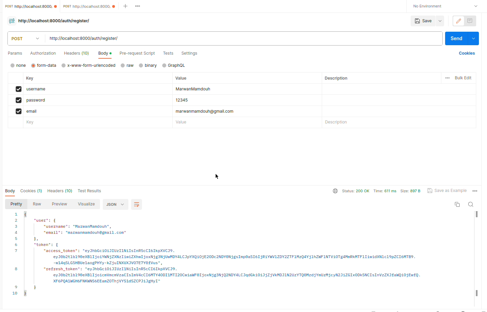

- handling error with validations of register
# 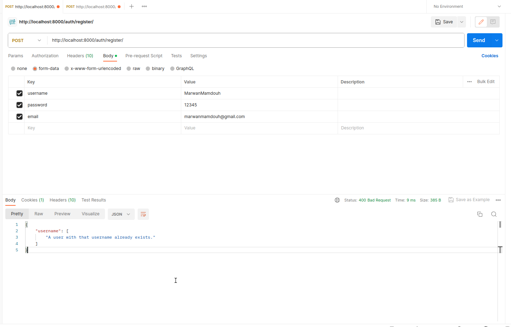

- Generate a JWT for a user
# 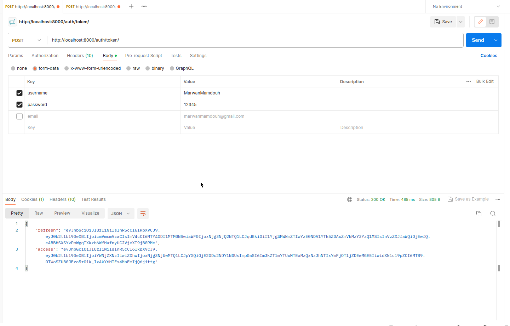  

- Refresh the token for the user
# 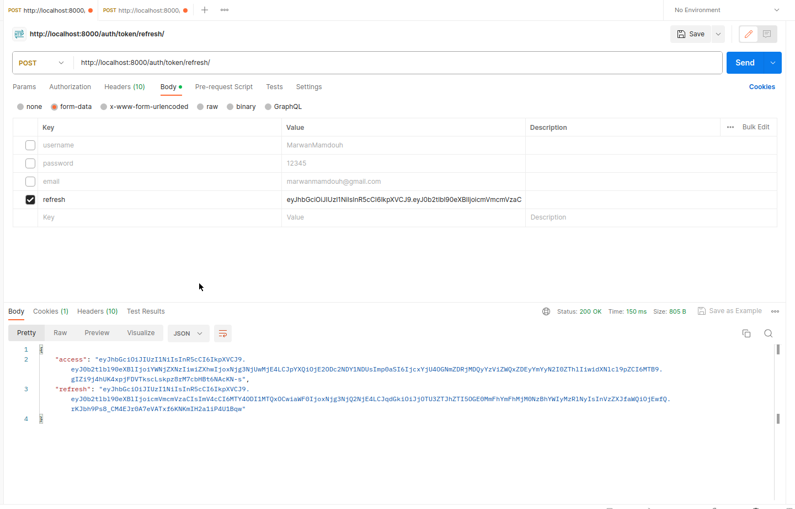

- Create new author
# 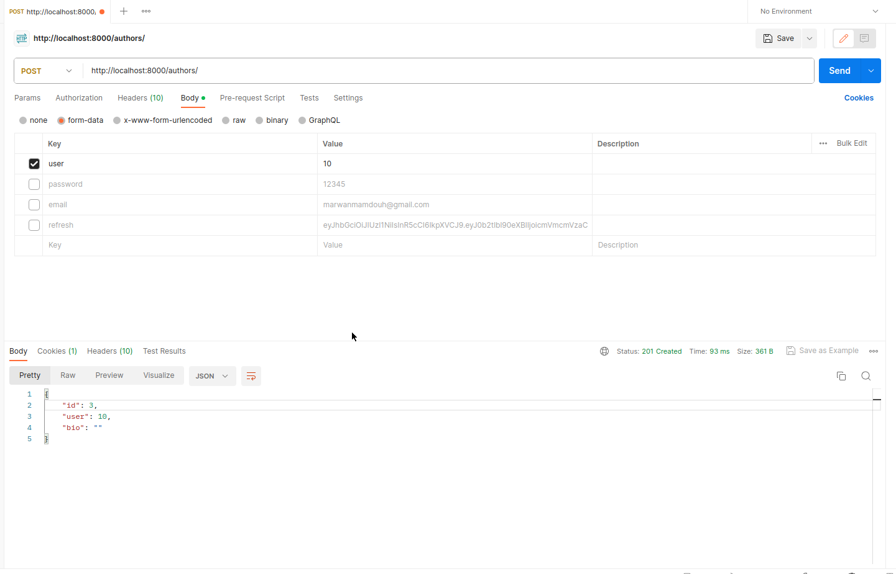 

- Get all books 
# 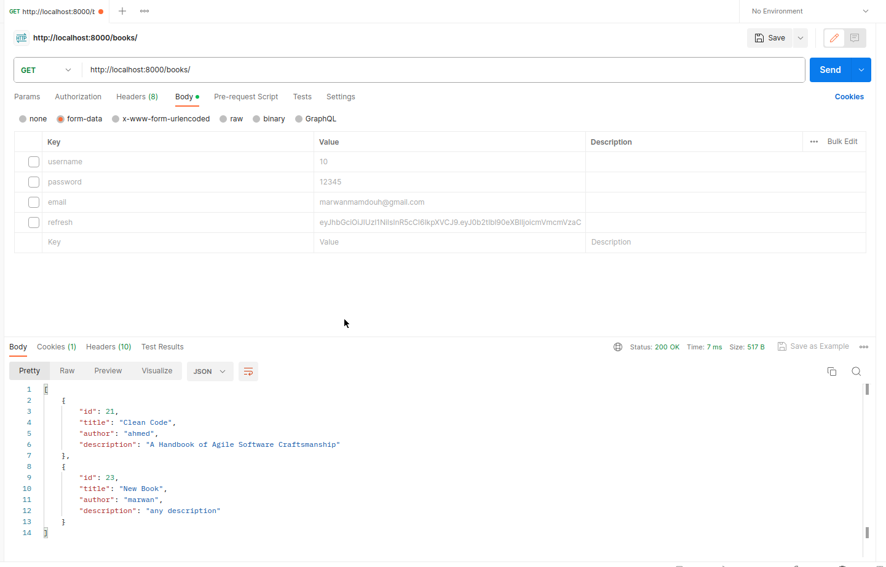 

- Get all pages of books
# 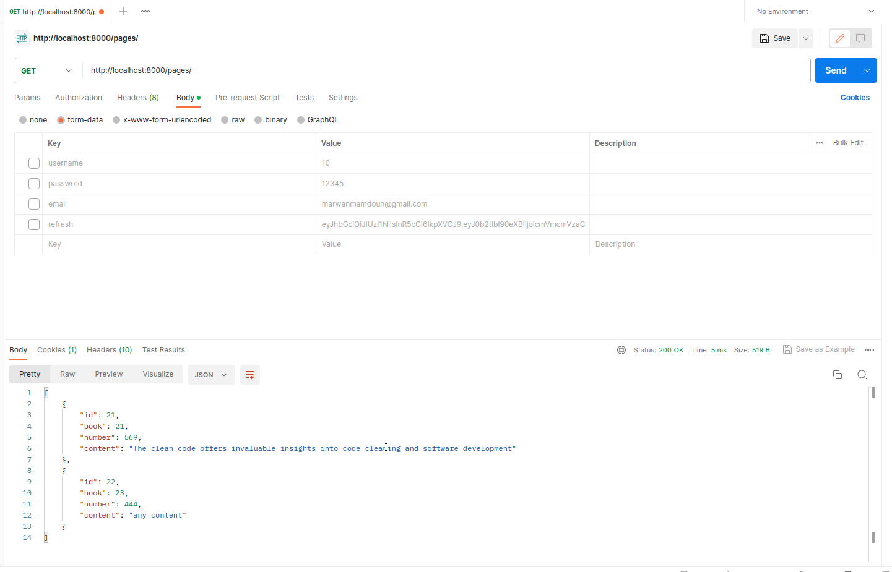 

- Trying to create a new page of the book and authentication error 
# 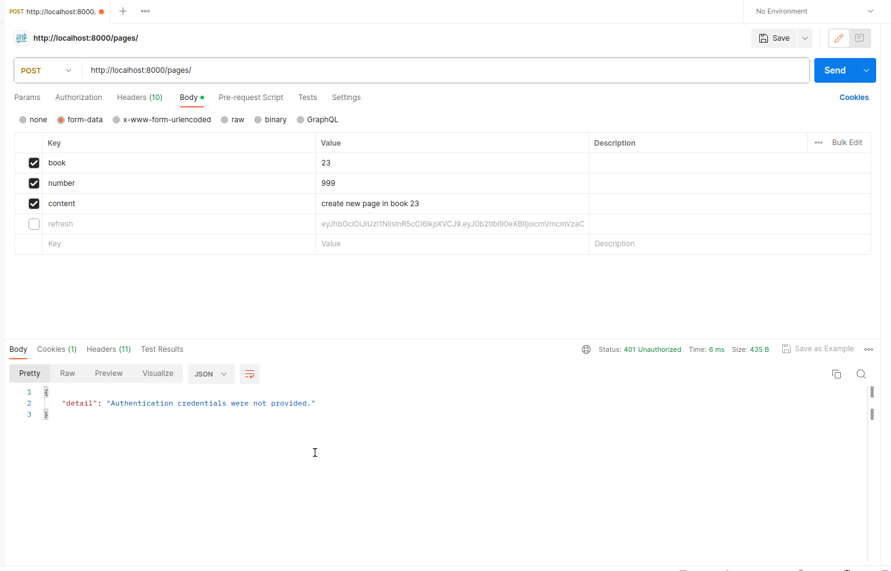 

- Add a authorization header to allow to user to create new book
# 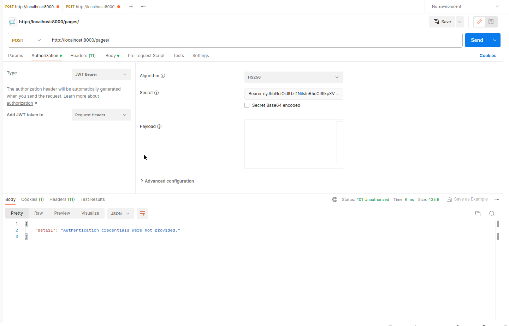 
#  
# 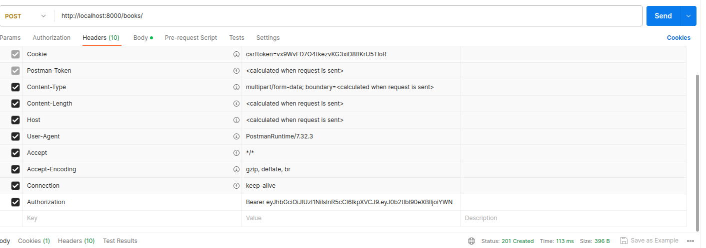

- Created book successfully with JWT
# 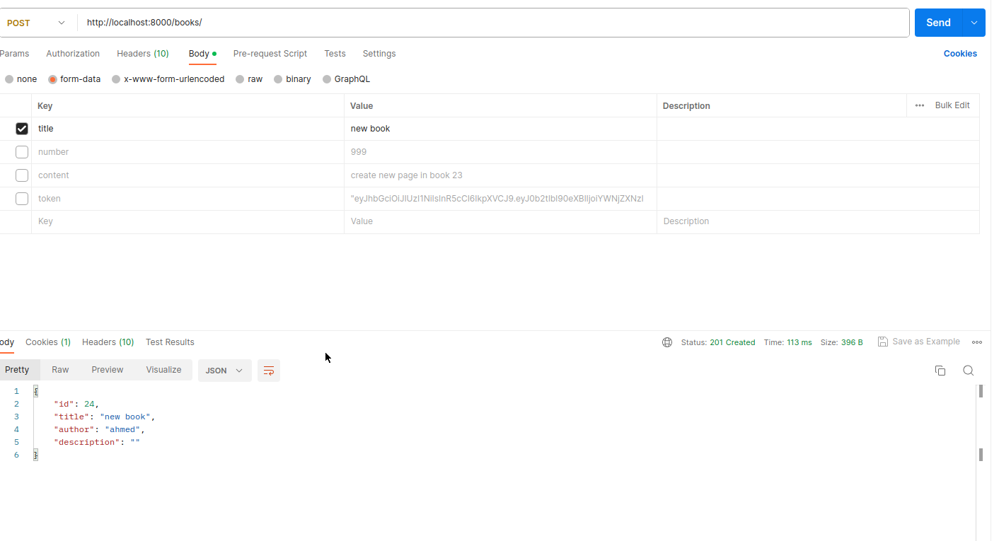 

## Note
The API uses serialization to convert model instances to JSON format and vice versa. 
This is handled by the Django REST Framework, which provides a set of serializers that allow you to easily serialize and deserialize complex data types. In this project, I used serializers for the Book, Author, and Page models to convert their instances to JSON format and vice versa.

